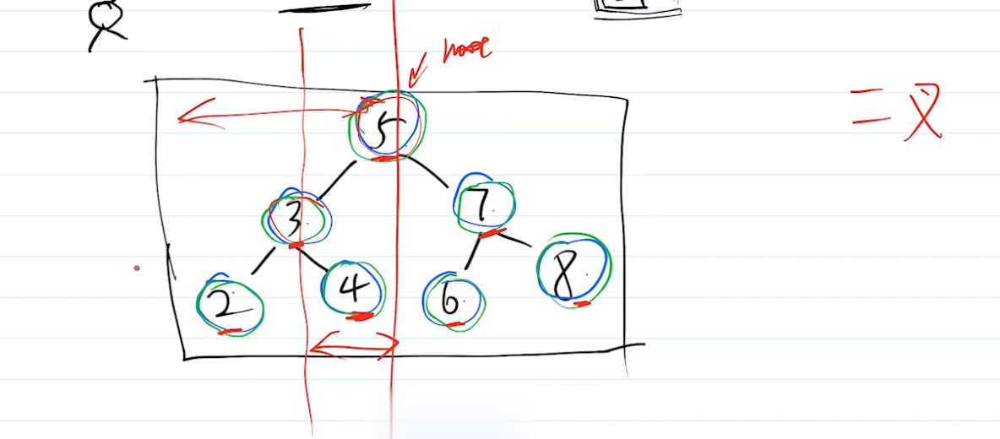
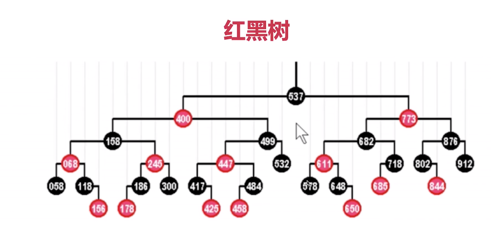
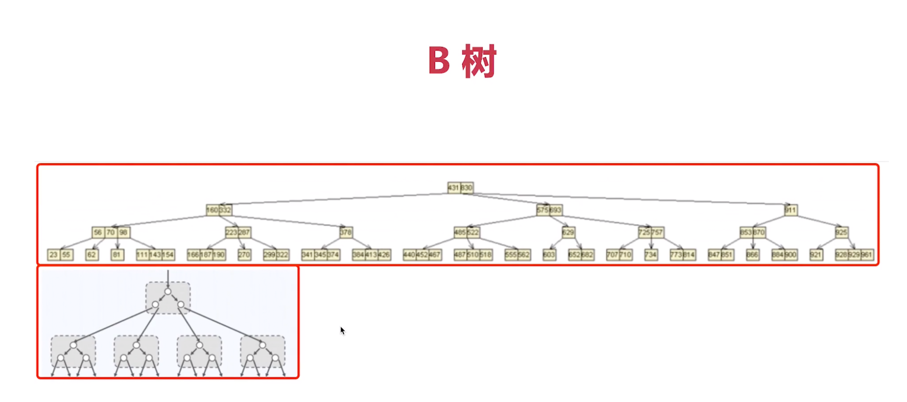

### 划重点：

#### 1.二叉搜索树BST （binary-search-tree）
#### 2.左子树的每个节点值都小于等于根节点
#### 3.右子树的每个节点值都大于等于根节点
#### 4.中序遍历二叉搜索树的结果一定是递增的
#### 5.可使用二分法进行快速查找

#### 6.平衡二叉搜索树BBST的概念
#### 7.BBST增删改查，其时间复杂度都是O(logn)，即树的高度

#### 8.红黑树：一种自平衡二叉树，分为红黑两种颜色，通过颜色转变来维持树的平衡
#### 9.二叉树维持平衡需要成本，红黑树是成本较低且速度较快的解决方案
#### 10.相对于普通平衡二叉树，红黑树维持平衡的效率更高

#### 11.B树：物理上是多叉树，但逻辑上是二叉树

### 小结：
#### 1.数组、链表各有优缺
#### 2.特定的二叉树（BBST），可以让整体效果最优
#### 3.各种高级二叉树，继续优化，满足不同的场景
