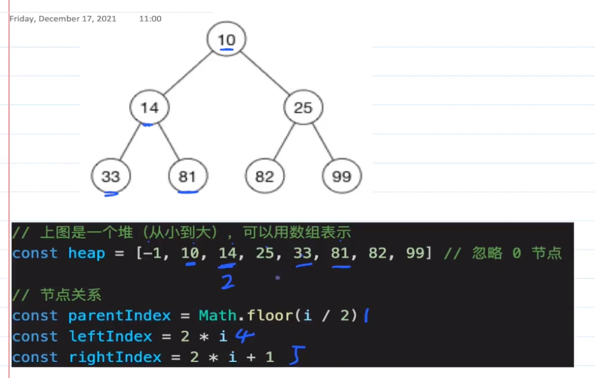

## 第二章：数据结构与算法（下）

### 划重点：

#### 1.理解二叉树
#### 2.理解二叉树的遍历：前序（根左右）、中序（左根右）、后序（左右根），根在前则为前序
#### 3.木桶效应：存在短板，导致能装的水不能超过短板，数组或链表在大批量复杂操作时会拖慢速度
#### 4.二叉搜索树BST，补齐了数组、链表的短板

#### 5.堆栈模型：JS代码执行时，基本类型变量存储在栈内存，引用类型变量存储在堆内存
        * 引用类型变量的值存储在堆中，而其引用则保存在栈中（即栈保存的是引用类型变量的地址）

#### 6.堆：是一棵完全二叉树，特点：
        最大堆，父节点 >= 子节点
        最小堆，父节点 <= 子节点

#### 7.堆的逻辑结构是一棵二叉树，而它的物理结构是一个数组（数组的空间利用率是最高的）

#### 8.堆vsBST：查询慢，增删快，维持平衡更快（规则相对于BST更加简单）但时间复杂度仍在同一数量级，都是O(logn)
#### 9.堆的使用场景：

### 小结：

