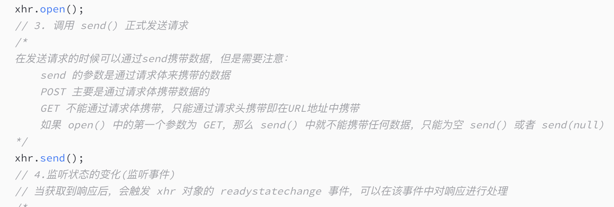
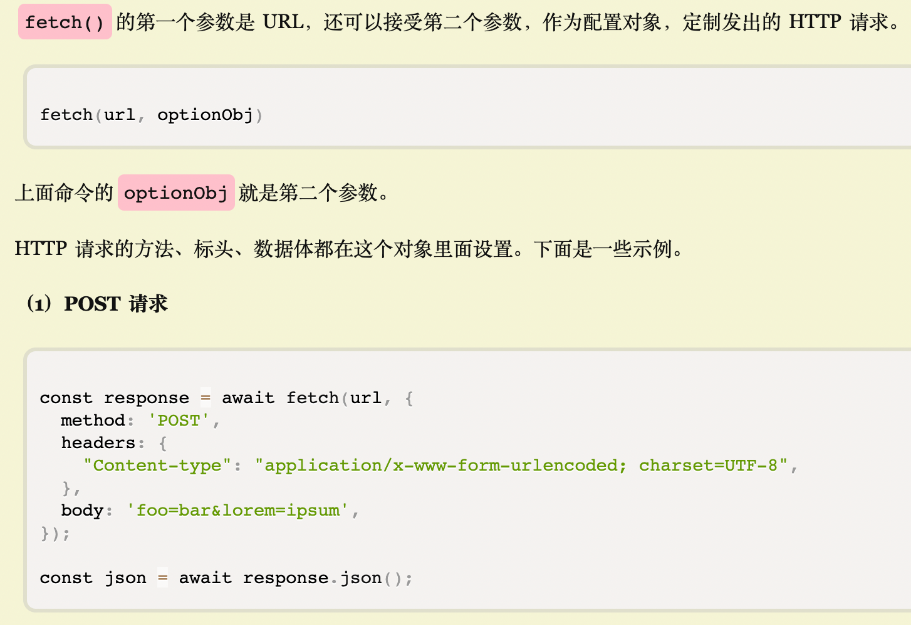
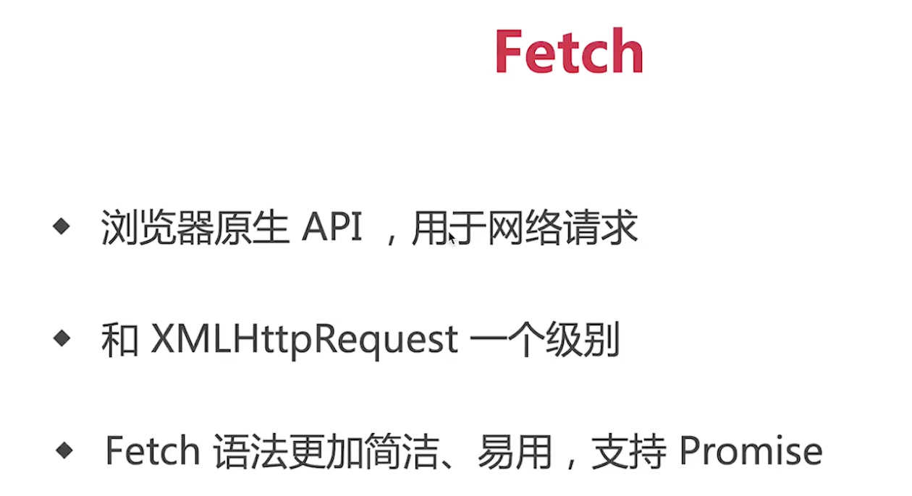
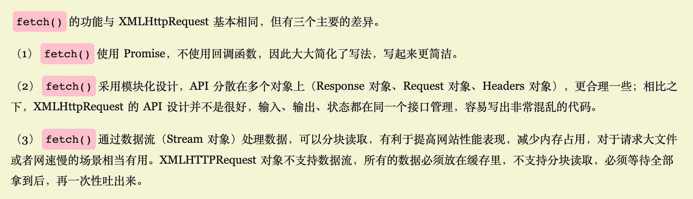
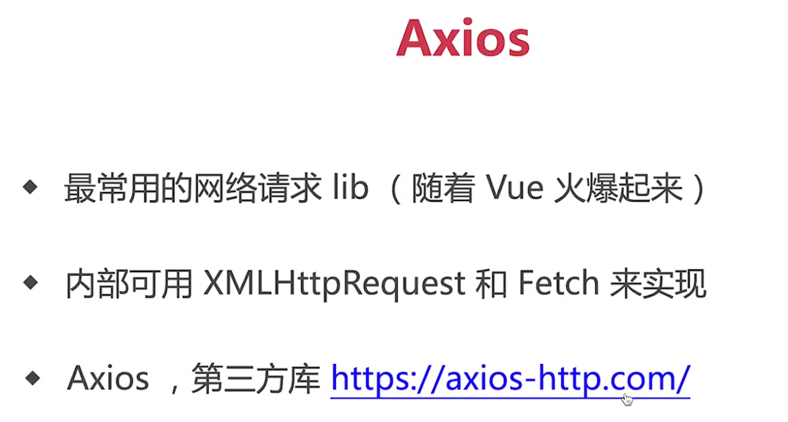
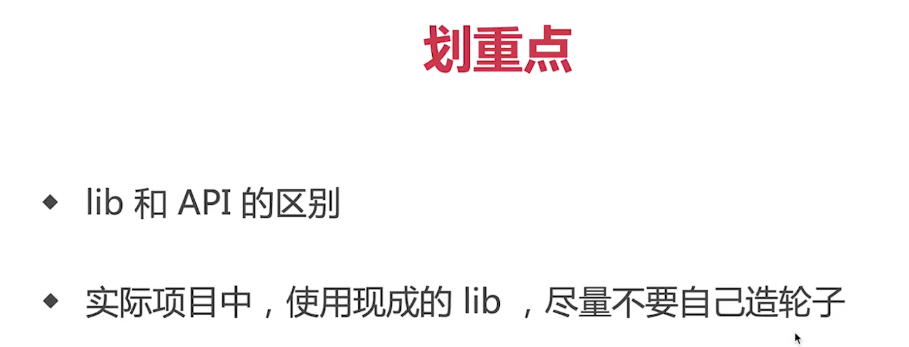

### 说明Ajax、Fetch、Axios三者的区别：

    1.三者都用于网络请求，但属于不同维度
    2.Ajax，是一种技术统称
    3.Fetch，是一个具体的API
    4.Axios，是一个第三方库

### 关于XMLHttpRequest：
    一、XHR.readyState == 状态（0，1，2，3，4） 
    0：请求未初始化，还没有调用 open()。 
    1：请求已经建立，但是还没有发送，还没有调用 send()。 
    2：请求已发送，正在处理中（通常现在可以从响应中获取内容头）。 
    3：请求在处理中；通常响应中已有部分数据可用了，没有全部完成。 
    4：响应已完成；您可以获取并使用服务器的响应了。

    二、XHR.status 响应状态码
    200——成功 
    201——提示知道新文件的URL
    300——请求的资源可在多处得到 
    301——删除请求数据
    404——没有发现文件、查询或URl 
    500——服务器产生内部错误 index.php

### 关于Fetch：
    1.Fetch默认发送GET请求
    2.Fetch接受的第二个参数用于配置HTTP请求

### Fetch之于XMLHttpRequest：

### 关于Axios：

### Axios之于Fetch之于XMLHttpRequest：
    1.axios是一个第三方库，而Fetch和XMLHttpRequest是原生API
    2.第三方库的实现需要底层API的支持

### 小结：
    1.学习途中可以自己造轮子
    2.工作中使用现成lib，这些lib经过了大量的验证，具有很高的鲁棒性
    3.现成的lib能够很大程度的提升开发效率

